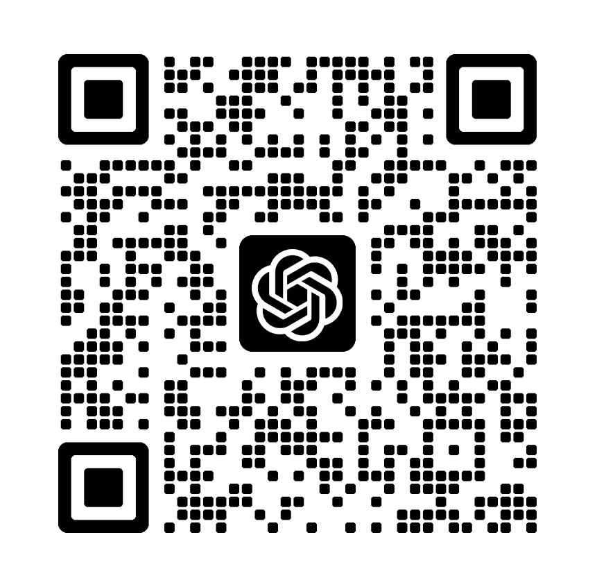

# Auth API Switcher Release Center

> This repository is the public release mirror for `Auth API Switcher`.
> 此仓库是 `Auth API Switcher` 的公开发布镜像仓。

> The full source code is maintained in a private source repository and is not stored here.
> 完整源码维护在私有源码仓中，不在此仓库存放。

> If you need source cooperation or private deployment, contact the author first.
> 如需源码合作或私有部署，请先联系作者。

## What This Repo Contains

- `release-manifests/stable/latest.json`: stable update manifest
- `release-manifests/stable/latest.json`：正式版更新清单
- `release-manifests/beta/latest_test.json`: beta update manifest
- `release-manifests/beta/latest_test.json`：内测版更新清单
- `release-manifests/beta/update-channel.override.json`: manual beta override file
- `release-manifests/beta/update-channel.override.json`：手动切换内测通道的覆盖文件
- `release-notes/*.md`: release notes for stable and beta channels
- `release-notes/*.md`：正式版与内测版的更新说明

## Channel Rules

- Stable releases update `release-manifests/stable/latest.json` and `release-notes/x.x.x.md`.
- 正式版发布只更新 `release-manifests/stable/latest.json` 和 `release-notes/x.x.x.md`。
- Beta releases update `release-manifests/beta/latest_test.json` and `release-notes/x.x.x_test.md` without touching the stable files.
- 内测版发布只更新 `release-manifests/beta/latest_test.json` 和 `release-notes/x.x.x_test.md`，不会碰正式版文件。
- Clients can enter the beta channel either by applying a beta authorization code or by placing `update-channel.override.json` into the local override location and restarting.
- 客户端可以通过应用内测授权码，或把 `update-channel.override.json` 放到本地覆盖位置后重启，进入内测通道。

## Manual Beta Override

- File name: `update-channel.override.json`
- 文件名：`update-channel.override.json`
- Recommended location 1: the application executable directory
- 推荐放置位置 1：应用程序可执行文件所在目录
- Recommended location 2: the Electron userData directory for this app
- 推荐放置位置 2：本应用对应的 Electron userData 目录
- After copying the file, restart the client to make the new channel take effect.
- 复制该文件后，重启客户端即可让新的更新通道生效。

## Contact

> Contact the author to discuss source access, authorization, deployment, or private customization.
> 如需洽谈源码、授权、部署或私有定制，请扫码联系作者。
